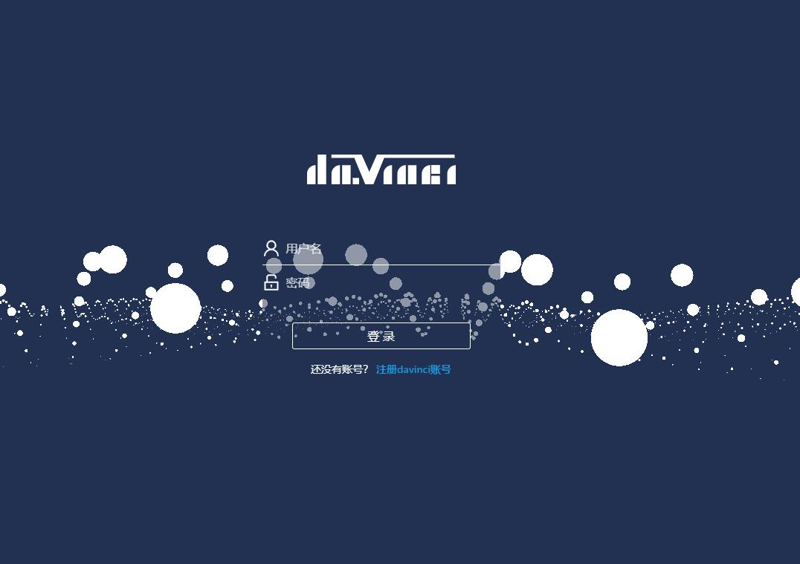

# davinci-boot
davinci 的一键启动版本，不会出现启动报错， Maven导包出错，去掉注册之后的邮箱验证，注册之后直接登录， 适合想自己快速部署起来查看效果的， 所有许可权限归原作者所有： https://github.com/edp963/davinci

### 效果预览

注册之后进入这个页面就可以返回登录页面进行登录了

### 可以在代码中全局搜索 @lucas 这个就是我修改的地方

### 宣传

微信公众号： ucisoft
知乎搜索：Andot、蚁点